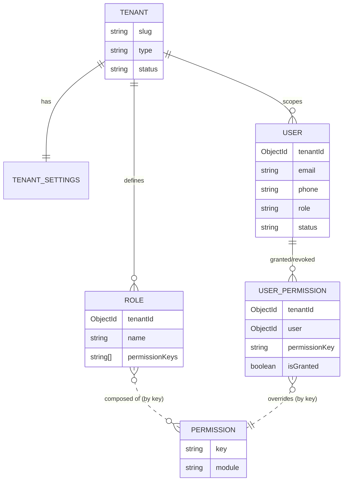
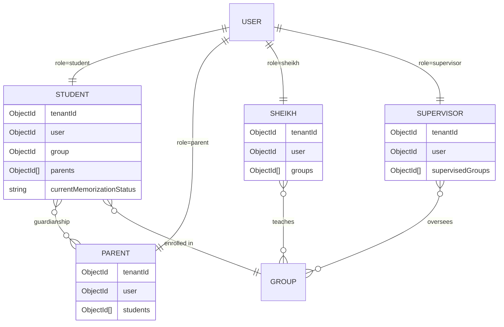
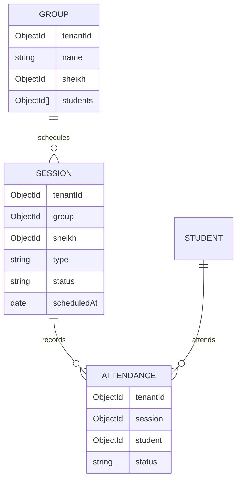
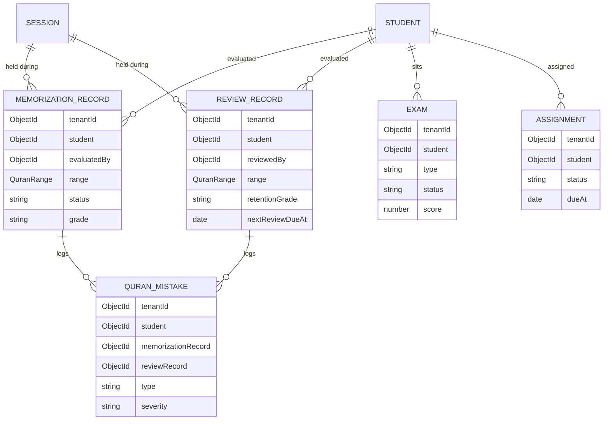
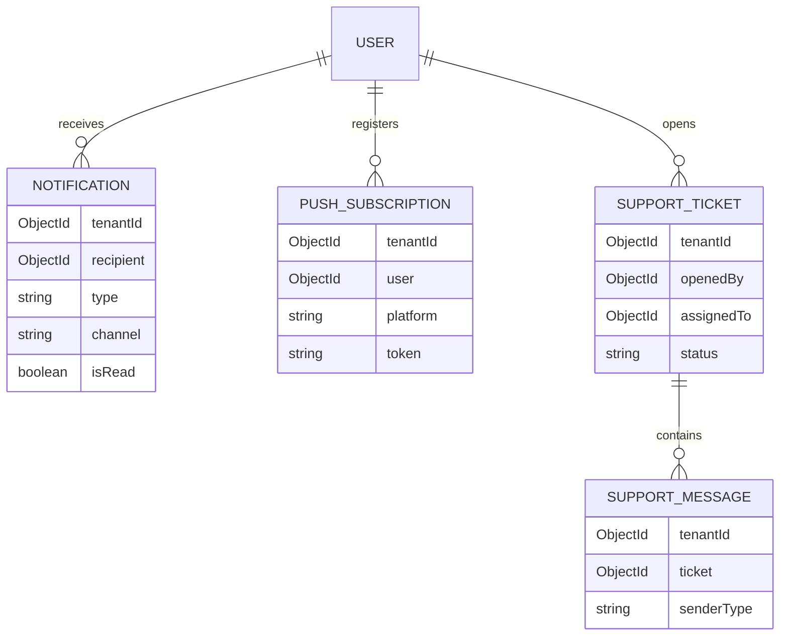
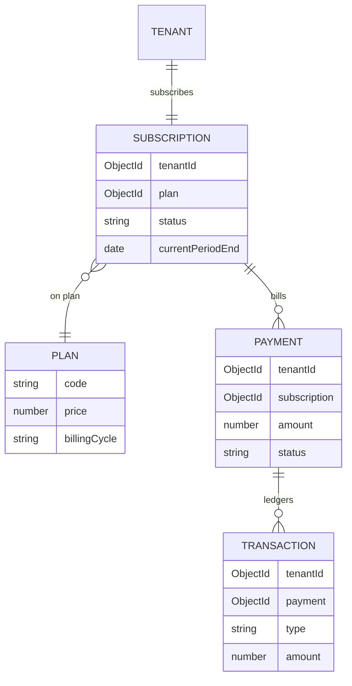
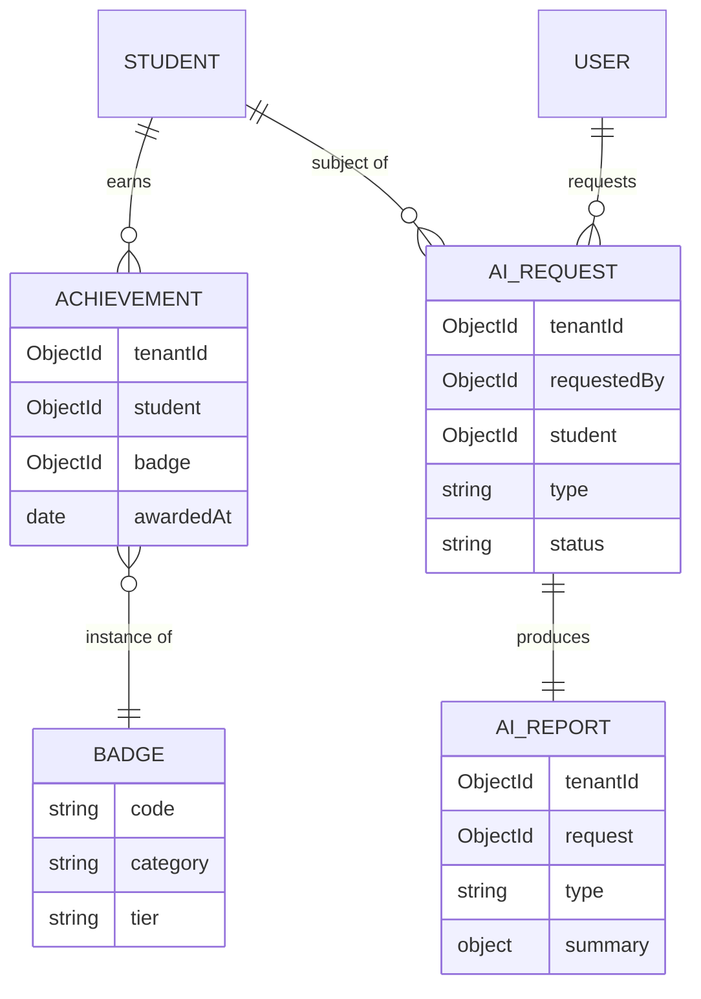
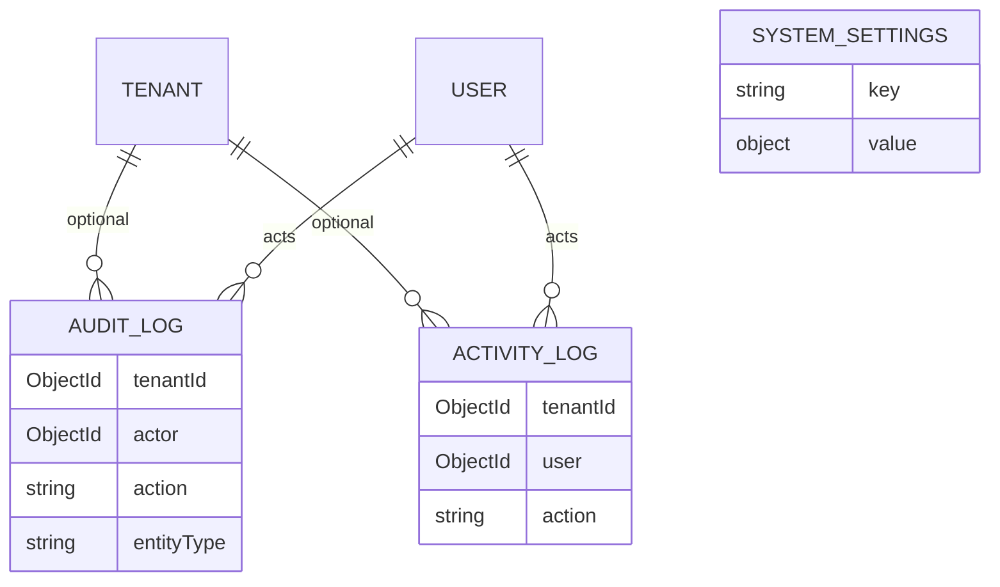

# Schema Diagrams (ER)

Mermaid ER diagrams, grouped by domain area (33 collections in a single
diagram is unreadable). Cardinality notation: `||--||` 1:1, `||--o{` 1:many,
`}o--o{` many:many. Fields shown are the relationship-relevant ones only —
see each `*.schema.ts` file for the full field list.

## 1. Identity & Access

## 2. People (role profiles)

## 3. Academic structure & attendance

## 4. Quran progress (memorization, review, mistakes, exams, assignments)

## 5. Communication

## 6. Billing

## 7. Gamification & AI

## 8. Platform observability (loosely coupled)

