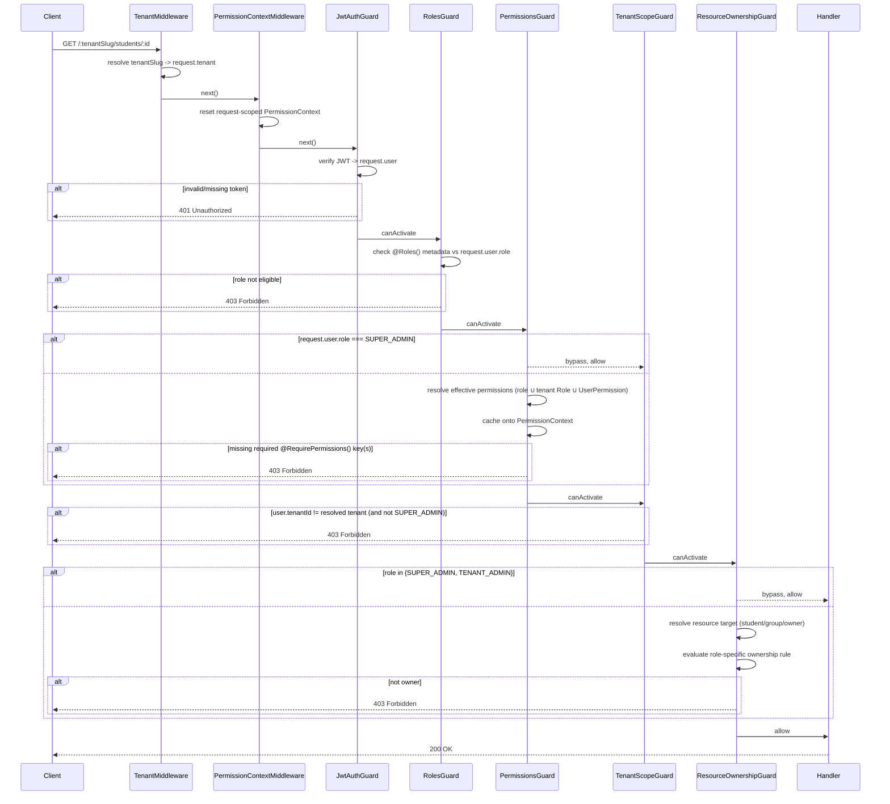

# Authorization Blueprint (RBAC) — Phase 3

## Status

**Phase 3 complete: authorization architecture only.** No controllers,
APIs, or feature business logic exist yet. This phase builds the
plumbing every future feature module will depend on to answer "is this
request allowed?" — nothing more.

## 1. Permission architecture

Three layers, each answering a different question, evaluated in order:

| Layer | Question | Enforced by |
|---|---|---|
| Authentication | Who are you? | `JwtAuthGuard` (Phase 1) |
| Role (coarse) | Is your role even eligible for this endpoint? | `RolesGuard` + `@Roles()` (Phase 1) |
| Permission (fine) | Does your effective permission set include this exact capability? | `PermissionsGuard` + `@RequirePermissions()` |
| Tenant scope | Does this request stay inside your own tenant? | `TenantScopeGuard` |
| Ownership (instance) | Do you specifically own *this* resource, not just resources of this kind? | `ResourceOwnershipGuard` + `@CheckOwnership()` |

### Permission key shape

Every permission is a string `<category>.<action>` — e.g. `students.create`,
`reports.export`, `groups.assign`. The full, curated set of valid keys is
generated once in `backend/src/shared/authorization/permission-registry.ts`
from:

- **18 categories**: users, students, parents, sheikhs, supervisors,
  groups, sessions, attendance, memorization, reviews, exams,
  assignments, notifications, reports, support, billing, ai, settings.
- **7 actions**: create, read, update, delete, export, approve, assign.

Not every (category, action) pair is meaningful (e.g. `billing.create`
doesn't correspond to a real operation) — the registry's
`CATEGORY_ACTIONS` map is the deliberate, curated list of pairs that
exist. Referencing an unlisted key throws at startup
(`assertValidPermissionKey`), so a typo'd permission key fails loudly in
development instead of silently never matching.

Call sites never hand-type a key string — they use the generated
`PERMISSIONS` const:

```ts
@RequirePermissions(PERMISSIONS.STUDENTS.CREATE)
@RequireAnyPermission(PERMISSIONS.EXAMS.APPROVE, PERMISSIONS.REVIEWS.APPROVE)
```

### Permission Registry → Permission Seeder

`PERMISSION_REGISTRY` (config, in code) is the source of truth;
`PermissionSeeder` (`backend/src/database/seeders/permission.seeder.ts`)
idempotently upserts it into the `permissions` collection (Phase 2
schema) by `key`. Run manually or from a deploy hook — not wired to any
HTTP route, per Phase 3's "no APIs" instruction:

```
ts-node -r tsconfig-paths/register src/database/seeders/run-permission-seeder.ts
```

### Effective permission resolution

A user's actual, effective permission set — computed by
`PermissionResolverService` — is the union/override of three sources,
in this precedence (later steps win):

1. **Role permissions** — `ROLE_PERMISSION_MATRIX[role]` for every role
   the user holds, plus any tenant `Role` document (system role override
   or **custom role**, per the "future custom roles" requirement) whose
   `name` matches one of the user's roles.
2. **Direct grants** — `UserPermission` documents with `isGranted: true`
   add extra keys on top of role permissions (e.g. one sheikh gets
   `exams.approve` without a new role).
3. **Direct revocations** — `UserPermission` documents with
   `isGranted: false` remove a key even if a role grants it. Revocation
   always wins.

**Multiple roles per user**: `User.roles` (Phase 2 schema, updated in
this phase) is a non-empty array, not a single field — `resolveForUser`
unions `ROLE_PERMISSION_MATRIX[role]` across every role in it, and
`ResourceOwnershipGuard`/`OwnershipResolverService` grant ownership if
**any** held role satisfies that role's rule (e.g. a Sheikh who is also
a Supervisor owns a resource via either assignment path). `RolesGuard`
and `TenantScopeGuard` likewise check the full `roles` array, not a
single value.

**Super Admin bypass**: decided directly off the JWT-asserted
`user.roles` in every guard (`PermissionsGuard`, `TenantScopeGuard`,
`ResourceOwnershipGuard`) — **never** via a tenant-filtered database
lookup. This matters: a Super Admin's own `tenantId` is a reserved
platform tenant that will essentially never match the tenant resolved
from the URL when they act cross-tenant, so if bypass were decided by
querying "the user with this id in this tenant" it would silently fail
to find them and deny. Bypass must never depend on which tenant's data
happens to be visible in the current request. This is the **only**
bypass path in the system.

## 2. Role matrix

Six fixed system roles (`backend/src/shared/enums/roles.enum.ts`), default
permissions in `ROLE_PERMISSION_MATRIX`
(`backend/src/shared/authorization/role-permission.matrix.ts`):

| Role | Default permissions |
|---|---|
| **Super Admin** | *(bypass — not permission-gated at all)* |
| **Tenant Admin** | Every permission key in the registry — full control within their own tenant (tenant boundary enforced separately by `TenantScopeGuard`) |
| **Supervisor** | `students.read`, `sheikhs.read`, `groups.read/update/assign`, `sessions.read/update`, `attendance.read/export`, `memorization.read/approve`, `reviews.read/approve`, `exams.read/approve`, `assignments.read/approve`, `reports.read/export`, `notifications.create/read`, `support.create/read` |
| **Sheikh** | `students.read`, `groups.read`, `sessions.create/read/update`, `attendance.create/read/update`, `memorization.create/read/update/approve`, `reviews.create/read/update/approve`, `exams.create/read/update/approve`, `assignments.create/read/update/approve`, `notifications.create/read`, `support.create/read` |
| **Parent** | `students.read`, `attendance.read`, `memorization.read`, `reviews.read`, `exams.read`, `assignments.read`, `notifications.read`, `support.create/read` |
| **Student** | `attendance.read`, `memorization.read`, `reviews.read`, `exams.read`, `assignments.read`, `notifications.read`, `support.create/read` |

This is the **default baseline** every tenant is provisioned with
(materialized into `Role` documents at tenant-onboarding time, Phase 4+).
Tenant admins may edit a system role's `permissionKeys` or define
**custom roles** entirely — `PermissionResolverService` reads tenant
`Role` documents live, so matrix + database always compose rather than
one replacing the other.

## 3. Authorization flow diagram



Guard registration order (`AuthorizationModule`, global `APP_GUARD`s,
applied in this exact sequence): `JwtAuthGuard` → `RolesGuard` →
`PermissionsGuard` → `TenantScopeGuard` → `ResourceOwnershipGuard`.
`PermissionContext` is request-scoped and resolved at most once per
request — `PermissionsGuard` populates it; `TenantScopeGuard`/
`ResourceOwnershipGuard` never re-query it.

## 4. Ownership rules

Ownership answers "may THIS user act on THIS specific resource
instance", evaluated only for **Supervisor, Sheikh, Parent, Student** —
Super Admin and Tenant Admin always bypass (see §1/§3).

| Role | Owns... |
|---|---|
| **Student** | Only their own data — a resource whose `student` reference resolves to *their own* `Student` document (matched via `Student.user === self`), or their own `User`/`Student` profile document directly. |
| **Parent** | Only their linked children — a resource whose `student` reference is one of `Parent.students[]`, or their own `Parent`/`User` profile document. |
| **Sheikh** | Only assigned students/groups/sessions — a resource whose `group` reference is one of `Sheikh.groups[]` (a student/session/exam/assignment is "owned" via the group it belongs to), or their own `Sheikh`/`User` profile document. |
| **Supervisor** | Only supervised groups (and everything under them) — a resource whose `group` reference is one of `Supervisor.supervisedGroups[]`, or their own `Supervisor`/`User` profile document. |

A user holding multiple roles (e.g. Sheikh **and** Supervisor) is granted
ownership if **any** one of their roles satisfies its rule — the checks
above are evaluated per-role and OR'd together, never AND'd.

`ResourceType.USER` ownership additionally verifies the target `User`
document actually exists (and is not soft-deleted) in the given tenant
before comparing ids — a fabricated or cross-tenant/deleted id fails
closed rather than matching on string equality alone.

Implementation (`OwnershipResolverService`): every `ResourceType` is
first reduced to a small `{ studentId?, groupId?, ownerUserId? }` target
(e.g. an `Attendance` record resolves to its `student`'s id, which then
resolves to that student's `group`), then a single role-dispatch
evaluates the applicable rule from the table above against that target.
Adding a new resource type only requires teaching `resolveTarget` how to
reduce it — the four role rules never change.

A resource that does not exist (or exists in a different tenant) always
resolves to **denied**, never to "not applicable" — ownership checks fail
closed.

## 5. Tenant isolation rules

Layered with, not a replacement for, Phase 2's database-level tenant
isolation (`tenantId` on every tenant-owned document):

1. **Every authenticated request resolves exactly one tenant** from the
   URL path (`TenantMiddleware`, Phase 1) before any guard runs.
2. **`TenantScopeGuard`** enforces that the authenticated user's own
   `tenantId` (from their JWT/`User` document) matches the resolved
   tenant — a valid token issued for tenant A is rejected on tenant B's
   routes, even if the role/permission checks would otherwise pass.
3. **Payload tenant smuggling is blocked**: if a request body or query
   string carries an explicit `tenantId`, `TenantScopeGuard` requires it
   to match the resolved tenant too — closes the gap where a handler
   might naively trust a client-supplied `tenantId` on a write.
4. **`Role.SUPER_ADMIN` is the only exception** — not bound to a single
   tenant, may act across tenants. Even so, every operation must name an
   explicit target tenant (via the URL); there is no "act on all tenants
   at once" implicit mode anywhere in this design.
5. **Resolvers stay tenant-scoped internally**: `PermissionResolverService`
   and `OwnershipResolverService` both filter every query by `tenantId`
   (never a bare `_id` lookup) — even if a guard upstream had a bug, the
   resolvers themselves cannot leak a cross-tenant document into a
   decision.
6. **Global catalogs are the sanctioned exception, not a loophole**:
   `permissions` (this phase) and `plans`/`badges`/`tenants` (Phase 2)
   have no `tenantId` by design — they are read-only reference data every
   tenant shares, never written to per-request, so they carry no
   isolation risk.

## 6. Multiple roles, direct grants, and future custom roles — how they compose

- **Multiple roles per user**: fully implemented, not deferred —
  `User.roles: Role[]` (non-empty) is the field guards and resolvers
  read; `PermissionResolverService` unions matrix permissions across all
  of them, `OwnershipResolverService` grants ownership if any one role
  satisfies its rule, and `RolesGuard`/`TenantScopeGuard` check the array
  with `.includes()`/`.some()` rather than assuming a single role.
- **Direct user permissions**: `UserPermission` (Phase 2 schema) grants or
  revokes one specific key per user, independent of role — always
  resolved last, so a revocation is never silently overridden by a role
  grant.
- **Future custom roles**: a tenant admin composing a new `Role` document
  with arbitrary `permissionKeys` (drawn from `PERMISSION_REGISTRY`) is
  already fully supported — `PermissionResolverService` looks up tenant
  `Role` documents by name with no special-casing of "system" vs.
  "custom", so this requires zero authorization-layer code changes when
  Phase 4+ builds the actual role-management UI/API.

## 7. Related documents

- Database schemas these rules read from: [`04-database-blueprint.md`](./04-database-blueprint.md)
- Multi-tenant URL resolution: [`05-multi-tenant-blueprint.md`](./05-multi-tenant-blueprint.md)
- Backend module layering: [`02-backend-architecture.md`](./02-backend-architecture.md)
