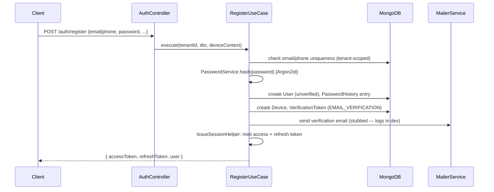
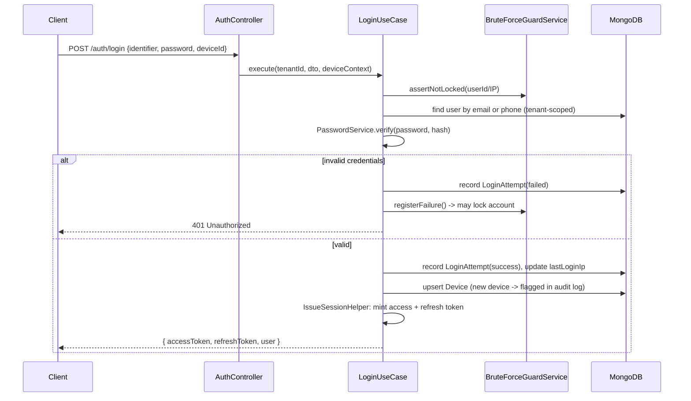
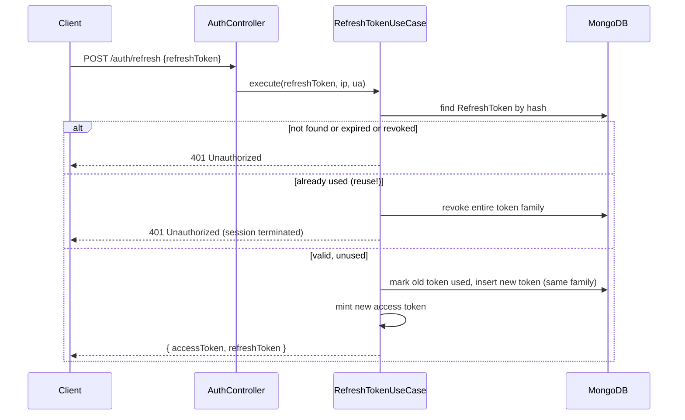
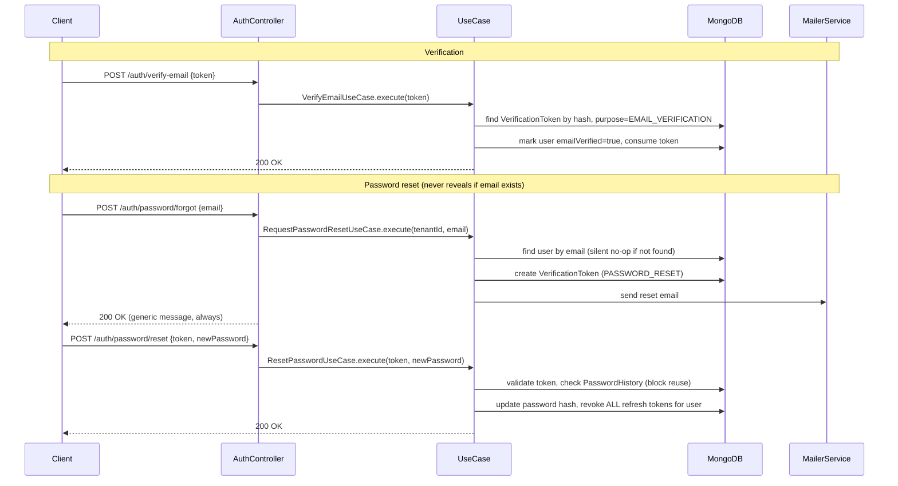
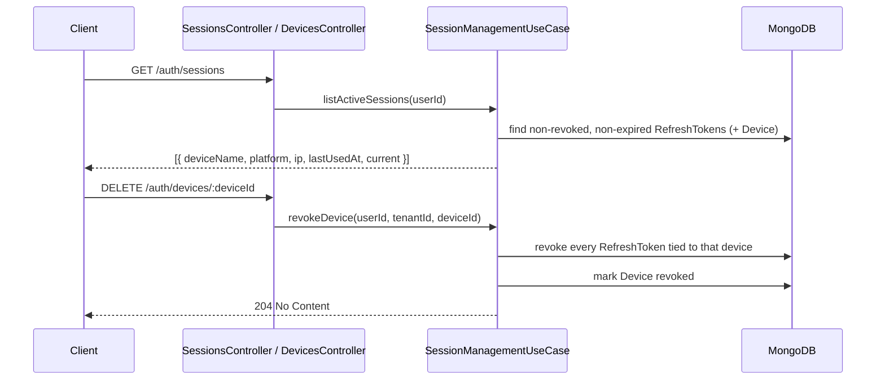

# Authentication Blueprint — Phase 4

## Status

**Phase 4 complete: Authentication, Session, and Device modules — working
code, not just structure.** Every route, use case, repository, and
strategy described below exists and type-checks (`tsc --noEmit` passes
against `backend/tsconfig.json`). Business/domain features (Quran
circles, memorization, etc.) are still untouched, per scope. Waiting on
approval before Phase 5.

## 1. Scope

| In scope | Out of scope (explicitly) |
|---|---|
| Email + Password | SMS OTP |
| Phone + Password (identity only) | Phone verification |
| Google OAuth | Phone-based password reset |
| Apple Sign In | — |
| Email verification | — |
| Email-based password reset | — |
| Multi-device session management | — |
| JWT access + refresh, with rotation + revocation | — |
| Argon2 hashing + password history | — |
| Brute-force / rate-limiting / suspicious-login detection | — |
| Future hooks: Passkeys/WebAuthn, biometric, 2FA/TOTP | Actual Passkey/2FA *enforcement* (schema + enums ready, not wired) |

Phone is stored and used purely as an alternate **identity** for
email+password-style login (`phone` + `password`) — there is no phone
verification flow and no phone-based recovery. All verification and
account recovery is **email-only**.

## 2. Bounded contexts

Three contexts share one NestJS module (`AuthModule`) because they are
transactionally and conceptually inseparable (a login always touches
all three), but each has its own domain boundary:

| Context | Owns | Controller |
|---|---|---|
| **Authentication** | credentials, verification, password reset, OAuth identity linking | `AuthController` (`/auth/*`) |
| **Session** | refresh token lifecycle (issue/rotate/revoke), "active sessions" view | `SessionsController` (`/auth/sessions`) |
| **Device** | device fingerprint/registration, per-device revocation | `DevicesController` (`/auth/devices/:id`) |

```
backend/src/modules/auth/
├── domain/
│   ├── repositories/          # interfaces only — no Mongoose imports
│   └── value-objects/         # AccessTokenPayload, RefreshTokenPayload
├── application/
│   ├── dto/                   # class-validator request/response shapes
│   └── use-cases/             # one class per business operation
└── infrastructure/
    ├── controllers/
    ├── repositories/          # Mongoose implementations of domain interfaces
    ├── services/               # PasswordService, TokenService, MailerService,
    │                            # AuthAuditService, BruteForceGuardService,
    │                            # GoogleTokenVerifierService
    ├── strategies/             # JwtStrategy, GoogleStrategy, AppleStrategy
    ├── decorators/             # @Public(), @CurrentUser()
    └── helpers/                # request-context.helper (IP/UA extraction)
```

Domain layer has zero framework imports, consistent with every other
module — repository interfaces (`USER_AUTH_REPOSITORY`,
`REFRESH_TOKEN_REPOSITORY`, `DEVICE_REPOSITORY`,
`VERIFICATION_TOKEN_REPOSITORY`, `LOGIN_ATTEMPT_REPOSITORY`) are DI
tokens bound to Mongoose-backed classes in `infrastructure/repositories`.

## 3. Data model (Phase 2 schemas extended, Phase 4 schemas added)

| Schema | Purpose |
|---|---|
| `User` (extended) | + `lastLoginIp`, `failedLoginCount`, `lockedUntil`, `isMfaEnabled`, `mfaMethods` — MFA fields unused today, reserved for the future-hook phase |
| `Device` (new) | one document per device a user has logged in from: platform, name, fingerprint (`deviceId`), first/last seen, revoked flag |
| `RefreshToken` (new) | one document per issued refresh token: hashed token, device ref, family id (for rotation-reuse detection), expiry, revoked flag + reason |
| `VerificationToken` (new) | single-use, hashed, purpose-tagged (`EMAIL_VERIFICATION` / `PASSWORD_RESET`) tokens with expiry |
| `PasswordHistory` (new) | last N password hashes per user, to block immediate password reuse |
| `LoginAttempt` (new) | every login attempt (success/fail), used by `BruteForceGuardService` for lockout + suspicious-login signals |

Refresh tokens and verification tokens are **never stored raw** — only a
SHA-256 hash is persisted; the raw value is returned to the client once
and is unrecoverable from the database, mirroring how `PasswordService`
never stores plaintext passwords.

## 4. Token strategy

- **Access token**: short-lived JWT (`JWT_ACCESS_EXPIRES_IN`, default
  15m), signed with `JWT_ACCESS_SECRET`, carries
  `{ sub, tenantId, roles, email }` — validated by `JwtStrategy` on every
  protected request via the global `JwtAuthGuard` (Phase 3).
- **Refresh token**: opaque random value (not a JWT) returned to the
  client, hashed and stored server-side with a `familyId`. Presenting a
  refresh token:
  1. looks it up by hash,
  2. if valid → issues a new access token **and** rotates the refresh
     token (old one is marked `used`, a new one in the same family is
     issued),
  3. if the presented token was already marked `used` → the entire
     token family is revoked immediately (reuse-detection: this is the
     signal of a stolen refresh token being replayed).
- `JWT_REFRESH_SECRET` is reserved for a possible future move to signed
  refresh JWTs — today's opaque+hash approach is used instead, since an
  opaque token carries no inspectable/decodable payload client-side.

## 5. Flows

### 5.1 Registration (email or phone identity)



### 5.2 Login (email/phone + password)



### 5.3 Token refresh (rotation + reuse detection)



### 5.4 Email verification & password reset (email-only)



### 5.5 OAuth (Google / Apple)

Two entry points per provider, to support both web (redirect) and
mobile (native SDK) clients:

- **Web redirect**: `GET /auth/google` → Passport redirects to Google →
  `GET /auth/google/callback` → `OAuthLoginUseCase`.
- **Native token exchange** (used by the Flutter app, and by Apple —
  Apple's native SDK returns an identity token directly, there is no
  redirect flow to mirror): `POST /auth/google/token` /
  `POST /auth/apple/token` with `{ idToken }`, verified server-side
  (`GoogleTokenVerifierService` validates against Google's public keys;
  `AppleStrategy.verify` validates against Apple's JWKS), then handed to
  the same `OAuthLoginUseCase`.

`OAuthLoginUseCase` either links the OAuth identity to an existing user
(matched by verified email) or provisions a new, pre-verified user (an
OAuth-verified email is trusted), then mints a session exactly like
password login.

### 5.6 Session & Device management



`logout` revokes only the refresh token presented; `logout-all` revokes
every refresh token for the user (all devices) — the same mechanism
`ResetPasswordUseCase` uses internally after a password change.

## 6. Security architecture

| Concern | Mechanism |
|---|---|
| Password storage | Argon2id (`PasswordService`, `argon2` package) — never bcrypt/plain |
| Password reuse | `PasswordHistory` — last N hashes checked on reset (not on register) |
| Brute force | `BruteForceGuardService`: per-identifier + per-IP failure counters (`LoginAttempt`), progressive lockout via `User.lockedUntil` |
| Generic rate limiting | `@nestjs/throttler`, registered globally (`ThrottlerModule` + `APP_GUARD` in `app.module.ts`) — IP-based, config via `THROTTLE_TTL`/`THROTTLE_LIMIT` |
| Suspicious login detection | New-device and new-IP logins are flagged in `AuthAuditService` (extends the Phase 3 `AuditLog` with auth-specific `AuditAction` values) — hook point for future email alerts |
| Refresh token theft | Rotation + reuse detection (§4) — a replayed old token revokes the whole family |
| Token transport | Access token: `Authorization: Bearer`. Refresh token: response body today (mobile-first); a web build should move it to an `httpOnly` cookie — noted as a follow-up, not yet required |
| Enumeration resistance | `/auth/password/forgot` always returns the same generic message regardless of whether the email exists |
| Tenant isolation | Every credential lookup and token issuance is scoped by `tenantId` (path-resolved by `TenantMiddleware`, Phase 1) — the same email may exist as a distinct account in two different tenants |
| Public route bypass | `@Public()` decorator + `Reflector` check added to `JwtAuthGuard` and `TenantScopeGuard` (Phase 3 guards were "always require a user"; extended so registration/login/refresh/OAuth/verification routes can run without one) |

## 7. Future-ready hooks (not enforced yet)

These exist in the data model and enum layer so a later phase can turn
them on without another migration:

- `User.isMfaEnabled` / `User.mfaMethods: MfaMethod[]` (`TOTP`,
  `WEBAUTHN`, `SMS` — reserved) — no login flow currently checks these
  fields.
- `otplib` and `@simplewebauthn/server` are installed but unused —
  reserved for TOTP 2FA and Passkey/WebAuthn registration respectively.
- `TokenPurpose` enum already includes values beyond the two used today,
  making it straightforward to add e.g. `MFA_CHALLENGE` without an enum
  migration.

## 8. What Phase 5 will need from this phase

Every future bounded context authenticates purely through
`request.user` (an `AccessTokenPayload`) populated by the already-global
`JwtAuthGuard` — no other module ever touches `AuthModule` internals
directly except by importing `TokenService` (exported) if it ever needs
to mint a token outside a login flow (e.g. an invite-link flow in a
later phase).
